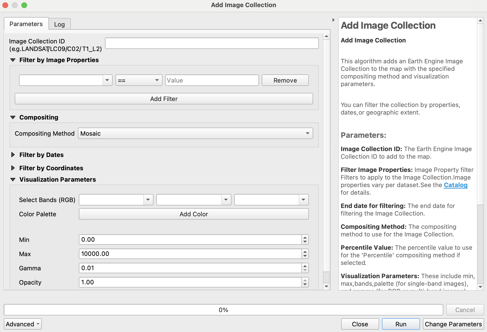
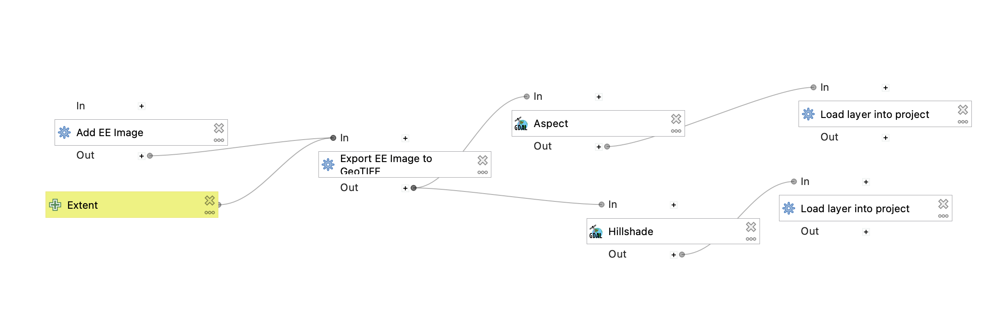

[](https://vshymanskyy.github.io/StandWithUkraine/)

# Google Earth Engine Plugin for QGIS

The **QGIS Earth Engine Plugin** integrates [Google Earth Engine](http://earthengine.google.com) with [QGIS](https://qgis.org/) using the [EE Python API](https://github.com/google/earthengine-api/tree/master/python).

📖 **[User Guide](https://gee-community.github.io/qgis-earthengine-plugin/)**

💬 **[Discussions & Support](https://github.com/gee-community/qgis-earthengine-plugin/discussions)**

🐞 **[Issue Tracker](https://github.com/gee-community/qgis-earthengine-plugin/issues)**


---

## 🚀 Quickstart Guide

### 1️⃣ Install the Plugin

- Open **QGIS Plugin Manager** (`Plugins > Manage and Install Plugins`).
- Search for **"Google Earth Engine"** and install it.

### 2️⃣ Find Your Google Cloud Project ID

Google Earth Engine requires a **Google Cloud Project**. To find your Project ID:

- Go to the [Google Cloud Console](https://console.cloud.google.com/).
- Your **Project ID** is visible in the URL or can be selected from the resource list.
- For more details, refer to the official [Google Cloud Project Management Guide](https://cloud.google.com/resource-manager/docs/creating-managing-projects).

### 3️⃣ Authenticate with your project ID

- Select the sign-in under `Plugins > Google Earth Engine > Sign-In`.
- Follow prompts to enter your project ID.

---

## 🌍 Using Earth Engine in QGIS

### Code Usage

You can use Earth Engine datasets programmatically within QGIS using the `Python Console`:

```python
import ee
from ee_plugin import Map

image = ee.Image('USGS/SRTMGL1_003')
vis_params = {
    'min': 0, 'max': 4000,
    'palette': ['006633', 'E5FFCC', '662A00', 'D8D8D8', 'F5F5F5']
}
Map.addLayer(image, vis_params, 'Digital Elevation Model')
Map.setCenter(-121.753, 46.855, 9)
```

### Algorithms via Processing Toolbox and Plugin Menu

Earth Engine algorithms are available from:

- The **Processing Toolbox** (`Processing > Toolbox > Google Earth Engine`)
- The **Plugin Menu** (`Plugins > Google Earth Engine`)

See [available algorithms](#-available-algorithms) for more details.



### Model Designer

Earth Engine algorithms can be integrated into QGIS **Model Designer** workflows:

- Open `Processing Toolbox > Models > Create New Model`
- Add and chain EE algorithms with other QGIS algorithms
- Save your custom processing model for repeated use

An [example model](https://github.com/gee-community/qgis-earthengine-plugin/blob/master/examples/srtm_hillshade.model3) is provided for the hillshade example below:



### Saving Your Project

Any layers and model workflows can be saved in your QGIS project file.  

Be sure to re-authenticate if opening the project on a new machine or after token expiry.

---

## ⚙️ Available Algorithms

The following algorithms are currently implemented in the plugin:

| Algorithm Name              | Description                                   |
| -------------------------- | --------------------------------------------- |
| Add EE Image               | Loads a single Earth Engine image             |
| Add Image Collection       | Loads a filtered Earth Engine image collection |
| Export GeoTIFF             | Exports an EE image as a Cloud-Optimized GeoTIFF to disk      |
| Add Feature Collection     | Loads a feature collection from Earth Engine  |

📌 Each algorithm includes in-dialog documentation to help guide usage directly within QGIS.

---

## 🗺️ Map Functions

The plugin supports several **Map API functions** similar to the Earth Engine Code Editor:

| Function                                                  | Description                         |
| --------------------------------------------------------- | ----------------------------------- |
| `Map.addLayer(eeObject, visParams, name, shown, opacity)` | Adds a dataset to QGIS.             |
| `Map.centerObject(object, zoom)`                          | Centers the map on an object.       |
| `Map.getBounds(asGeoJSON)`                                | Returns map bounds.                 |
| `Map.getCenter()`                                         | Gets the current center of the map. |
| `Map.setCenter(lon, lat, zoom)`                           | Moves the center of the map.        |
| `Map.getScale()`                                          | Returns the current map scale.      |
| `Map.getZoom()`                                           | Returns the current zoom level.     |
| `Map.setZoom(zoom)`                                       | Sets a new zoom level.              |

For more details, check the [EE API Documentation](https://developers.google.com/earth-engine/getstarted#adding-data-to-the-map).

---

## ❓ Troubleshooting

### Resetting Authentication

If you experience authentication issues:

- Run `earthengine authenticate` again.
- Delete the credentials file and restart QGIS:
  - **Windows:** `C:\Users\<USER>\.config\earthengine\credentials`
  - **Linux:** `/home/<USER>/.config/earthengine/credentials`
  - **MacOS:** `/Users/<USER>/.config/earthengine/credentials`

More on authentication troubleshooting: [Earth Engine Guide](https://developers.google.com/earth-engine/guides/auth).

### Common Errors

| Error                                              | Solution                                                                                                              |
| -------------------------------------------------- | --------------------------------------------------------------------------------------------------------------------- |
| `ModuleNotFoundError: No module named 'ee_plugin'` | Ensure the plugin is installed via QGIS Plugin Manager.                                                               |
| `earthengine authenticate` fails                   | Run `earthengine authenticate --quiet` and restart QGIS.                                                              |
| `ssl.SSLError: [SSL: CERTIFICATE_VERIFY_FAILED]`   | On MacOS, run `/Applications/Python 3.x/Install Certificates.command`.                                                |
| Plugin crashes after authentication                | Ensure your IP is not blocked by a firewall. Check [code.earthengine.google.com](http://code.earthengine.google.com). |
| `SRE module mismatch`                              | Set `PYTHONPATH` to plugin extlibs (e.g. `export PYTHONPATH=~/Projects/qgis-earthengine-plugin/extlibs`)              |

---

## 🤝 Contributing

We warmly welcome contributions! If you'd like to contribute:

1. Check out [CONTRIBUTING.md](CONTRIBUTING.md) for setup instructions.
2. Ensure your contribution relates to an existing [issue](https://github.com/gee-community/qgis-earthengine-plugin/issues) or discussion.
3. Open a pull request or issue before starting major changes.

For questions, contact the original author: [gennadiy.donchyts@gmail.com](mailto:gennadiy.donchyts@gmail.com).

For feature requests and updates, please check the [GitHub Issues](https://github.com/gee-community/qgis-earthengine-plugin/issues) and [Discussions](https://github.com/gee-community/qgis-earthengine-plugin/discussions).

Thank you for helping improve the QGIS Earth Engine Plugin!
