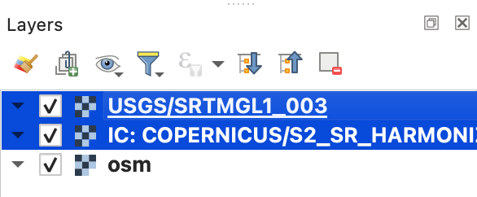
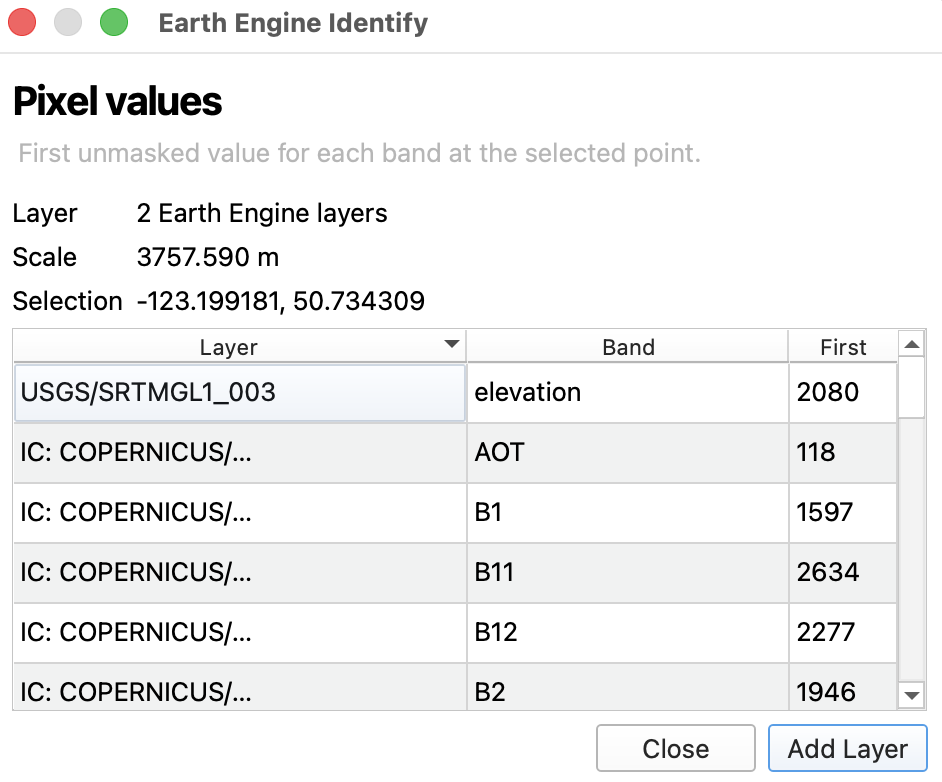
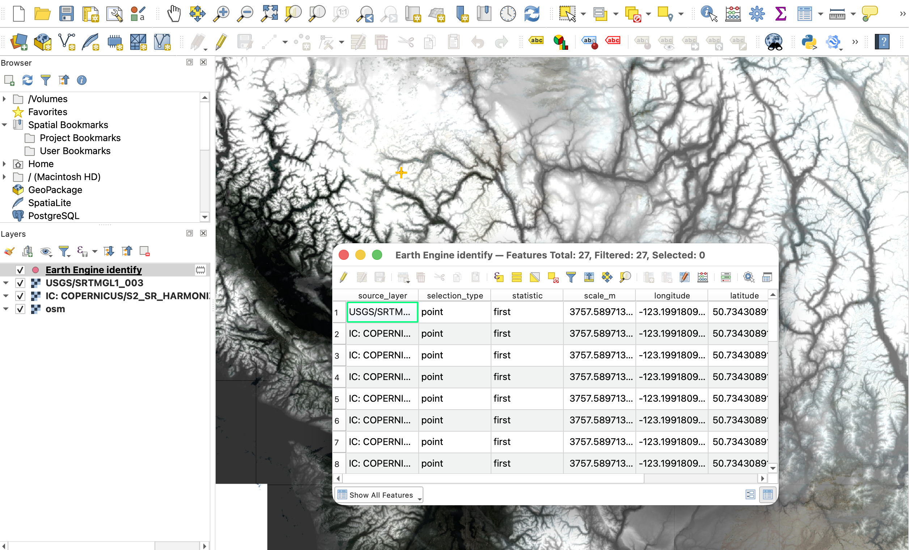

# Identifying Earth Engine Layers

The Google Earth Engine plugin includes an identify tool for inspecting values from Earth Engine raster layers in QGIS. Use it when you want to click a point or draw a box on the map and see the Earth Engine values for the selected location or area.

## Select Layers to Identify

Before using the identify tool, select one or more Earth Engine raster layers in the QGIS **Layers** panel. The selected layers are the layers highlighted in blue in the layer list.

If multiple Earth Engine layers are selected, the identify tool runs against all selected Earth Engine raster layers and shows the results together in one dialog. Layers that are not selected in the Layers panel are ignored.

## Run the Identify Tool

Click the **Identify Earth Engine Pixel or Region** tool from the Google Earth Engine plugin toolbar or menu.

Click once on the map to identify a point. For point identifies, the tool returns the first unmasked value for each band at the clicked location.

Click and drag a box on the map to identify a region. For region identifies, the tool returns the mean value for each band within the selected area.

## Save Identify Results

In the identify results dialog, click **Add Layer** to add the identify results as a temporary QGIS layer.

For a single selected Earth Engine layer, the output uses the existing single-layer result format. For multiple selected Earth Engine layers, the output includes one row per layer and band value, with fields for the source layer, band, and value.

