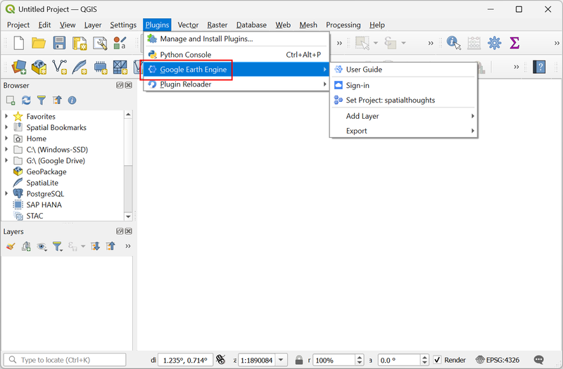

# Installation

The Google Earth Engine Plugin for QGIS can be installed by the Plugin Manager from the official QGIS plugin repository. The installation process involves a few extra steps to authenticate with your Google Earth Engine account and set the Google Cloud project. This step-by-step guide will help you install and configure the plugin.

1. In QGIS, open the Plugin Manager by going to *Plugins → Manage and Install Plugins…*

    

2. Select the *All* tab and search for `google earth engine`. From the results, select the **Google Earth Engine** plugin and click on the *Install Plugin* button to install it.

    

3. Once the installation finishes, the plugin manager will initialize the plugin. First, it will look for a `credentials` file in your home directory containing the authentication token. This file will exist if you have previously used the plugin or the Google Earth Engine Python API on your computer. If the credentials file is not found, you will be prompted to sign in to your Google Earth Engine account. Click *OK* to proceed.

    > Note: If you encounter any errors after installing the plugin, refer to the [Troubleshooting Guide](troubleshooting.md) for help.

    

4. A new tab will open in your web browser and you will be prompted to sign in to your Google account. If you have multiple accounts, make sure to select the one that is linked with Google Earth Engine.

    

5. Review the permissions and click *Allow*.

    

6. Upon successful completion of the authentication process, the credentials will be saved on your computer. You can close the browser tab now.

    

7. Next, you will be prompted to select the Google Cloud Project you want to use for the plugin. This step is required since many Earth Engine users have access to multiple projects for their account.

    

8. There are many ways to find out the name of the Google Cloud Project associated with your account. For most users of Google Earth Engine, the easiest way will be from the *Earth Engine Code Editor*. Open the [Earth Engine Code Editor](https://code.earthengine.google.com/) in a new web browser tab. Once signed-in, click on the account name in the top-right corner and select *Project Info*.

    

9. Copy the name of the *Cloud Project* displayed in the window.

    

10. Back in QGIS, paste the cloud project name in the *Select Earth Engine project* dialog and click *OK*.

    

11. The plugin will now be initialized with the selected cloud project.

    

12. Close the Plugin manager window. You will find the newly installed Google Earth Engine plugin in the *Plugins* menu.

    

13. The plugin also adds several algorithms to the QGIS Processing Toolbox. Open the toolbox from *Processing  → Toolbox* and see the available algorithms under **Google Earth Engine** provider.

    
