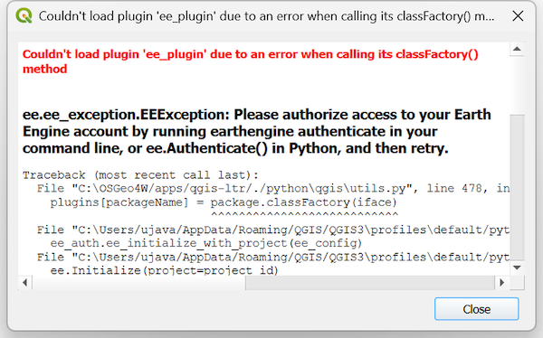

# Troubleshooting

The main challenge with installing and using the Google Earth Engine Plugin for QGIS is around authentication and selecting the cloud project. This page will help you identify and debug common issues.

## Authentication error while initializing the plugin

If the plugin fails to initialize after installation or during QGIS startup, you need to re-authenticate using Python Console.



Open the Python Console from *Plugins → Python Console*.


In the *Console*, enter the following 2 lines of code. Press *Enter* after entering each line. This code will re-launch the authentication flow on your web browser.

```
import ee
ee.Authenticate()
```


Complete the authentication. Once done, go to the Plugin Manager from *Plugins → Manage and Install Plugins…* , select the *Installed* tab and enable the **Google Earth Engine** plugin.

## Resetting Authentication

If you continue to experience authentication issues, it is advisable to clear the stored credentials on your computer and re-initialize the plugin.

The credentials file is stored in the user home directory. The path to the file depends on on your operating system as indicated below.


  - **Windows:** `C:\Users\<USER>\.config\earthengine\credentials`
  - **Linux:** `/home/<USER>/.config/earthengine/credentials`
  - **MacOS:** `/Users/<USER>/.config/earthengine/credentials`

  
## Troubleshooting Common Errors

| Error                                              | Solution                                                                                                              |
| -------------------------------------------------- | --------------------------------------------------------------------------------------------------------------------- |
| `ModuleNotFoundError: No module named 'ee_plugin'` | Ensure the plugin is installed via QGIS Plugin Manager. |
| `ssl.SSLError: [SSL: CERTIFICATE_VERIFY_FAILED]`   | On macOS, run `/Applications/Python 3.x/Install Certificates.command`. |
| Plugin crashes after authentication                | Ensure your IP is not blocked by a firewall. Check [code.earthengine.google.com](https://code.earthengine.google.com). |
| `SRE module mismatch`                              | Set `PYTHONPATH` to plugin extlibs (e.g. `export PYTHONPATH=~/Projects/qgis-earthengine-plugin/extlibs`). |

