# Downloading Images from Earth Engine

The Google Earth Engine plugin comes with a handy `Export Image to GeoTIFF` algorithm that allows you to download images from GEE directly to your computer as GeoTIFF files. In this tutorial, we will use the plugin to create a Sentinel-2 median composite for a region and download it as a GeoTIFF file.

1. Open QGIS. To help us select a region of interest, it will be helpful to have a basemap. From the QGIS Browser Panel, locate the *XYZ Tiles → OpenStreetMap* layer and drag it to the canvas.

    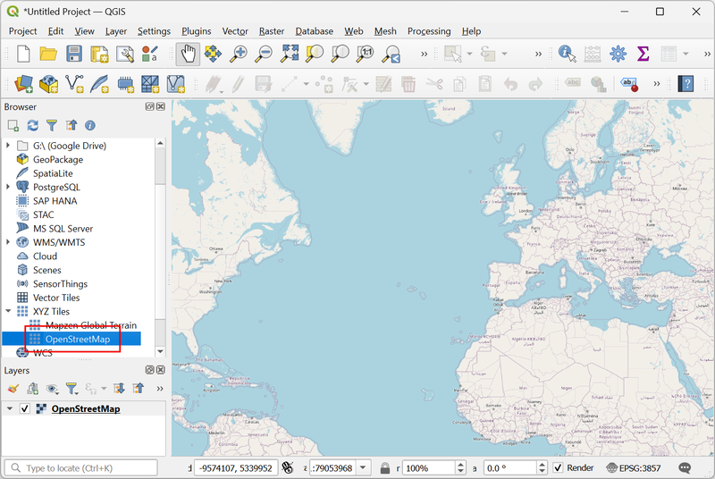

2. We can use the QGIS’s built-in geocoder to search for a place. For this tutorial, we want to download imagery over Paris. Select the locator bar in the bottom left corner and enter the search term `> paris`. Make sure there is a space between the `>` character and the search term. From the results, click on the first one to zoom to the location.

    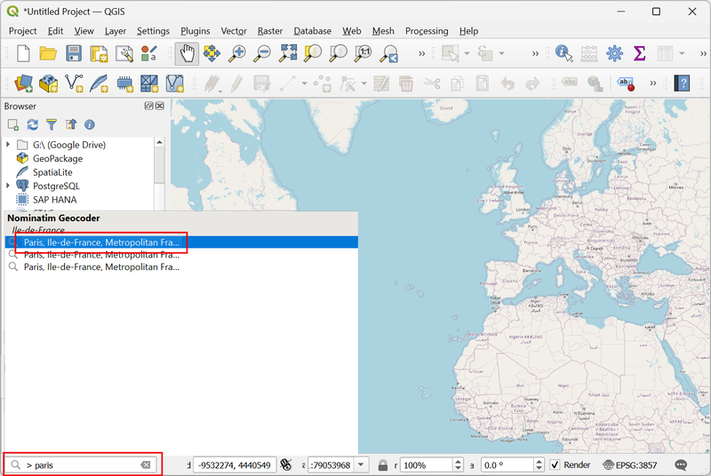

3. Zoom and pan the map to the desired extent. Open the Processing Toolbox from *Processing → Toolbox*. Locate the *Add Image Collection* algorithm from the Google Earth Engine provider. Double-click to open it.

    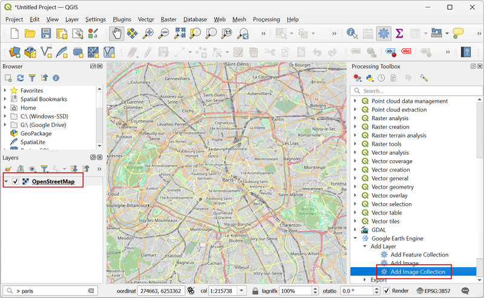

4. To add an Image Collection, we first need to find the Image Collection ID for the Sentinel-2 Level-2A collection. 

    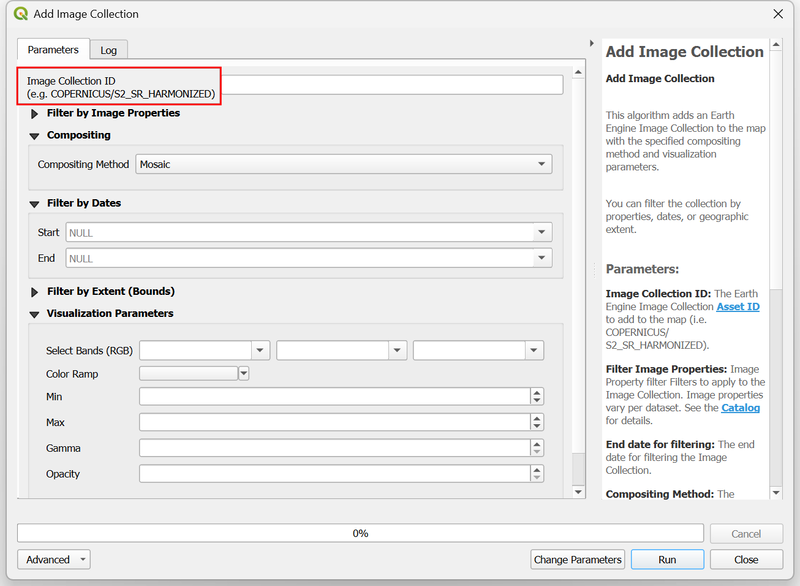

5. Open the [Earth Engine Data Catalog](https://developers.google.com/earth-engine/datasets/) and navigate to the dataset page for [Harmonized Sentinel-2 MSI: MultiSpectral Instrument, Level-2A (SR)](https://developers.google.com/earth-engine/datasets/catalog/COPERNICUS_S2_SR_HARMONIZED). Copy the Image Collection ID `COPERNICUS/S2_SR_HARMONIZED` shown on the page.

    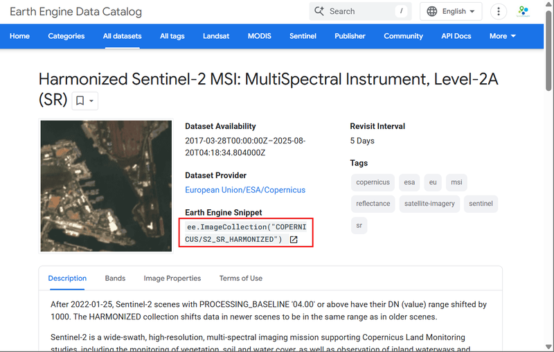

6. Back in the *Add Image Collection* dialog, paste the Image Collection ID `COPERNICUS/S2_SR_HARMONIZED`. Next, we can apply a metadata filter to select images with less cloud. In the *Filter by Image Properties* section, select `CLOUDY_PIXEL_PERCENTAGE` as the property, `<` as the operator and enter `30` as the value. This will select all images with < 30% cloud cover.

    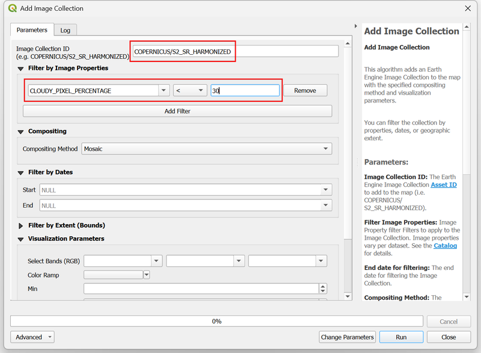

7. In the *Compositing* section, select `Median` as the *Compositing Method*. This method will take all available images and calculate the median value for each pixel. For optical imagery, such as Sentinel-2, this method is useful in selecting the best representative pixel for the chosen duration without being affected by outliers such as clouds and cloud-shadow. We want to create an annual composite, so in the *Filter by Dates* section, enter the *Start* and *End* dates as `01-01-2024` and `01-01-2025`. 

    > Remember that the *End* date in the Earth Engine date filter is *exclusive* - so we need to add an extra day to ensure do not exclude the last day of the year.

    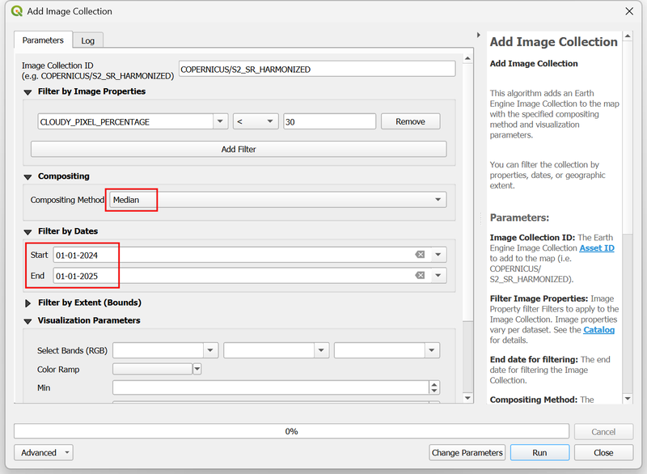

8. Expand the *Filter by Extent (Bounds)* section. Click the `Map Canvas Extent` button to load the selected region in the canvas.

    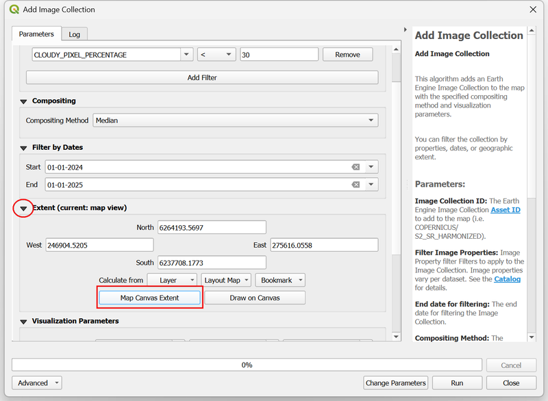

9. Before loading the image, we need to specify the visualization parameters. For multi-band images, we can select 3 bands to be used for visualization. We will visualize the resulting image in natural color, so select `B4` (Red) , `B3` (Green) and `B2` (Blue) as the bands. The typical range of pixel values for Sentinel-2 images are between 0-3000, so enter `0` as *Min* and `3000` as *Max*. Check the *Clip to Extent* box to load only the pixels within the selected extent and click *Run*.

    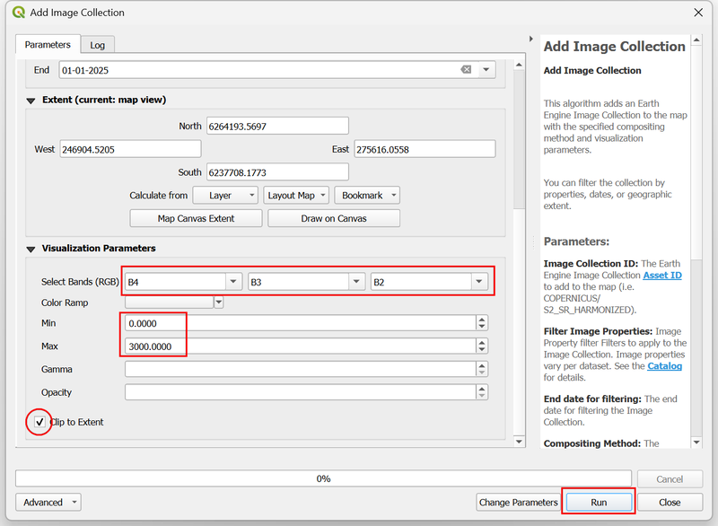

10. Once the algorithm finishes, a new layer `IC: COPERNICUS/S2_SR_HARMONIZED (Median)` will be added to the *Layers* panel. This layer is being streamed from the Earth Engine servers. As you zoom or pan the image - new pixels will be computed on-the-fly and displayed. Let’s download this image so we can use it within QGIS for analysis. Locate the `Export → Export Image to GeoTIFF` algorithm from the Google Earth Engine provider in the Processing Toolbox. Double-click to open it.

    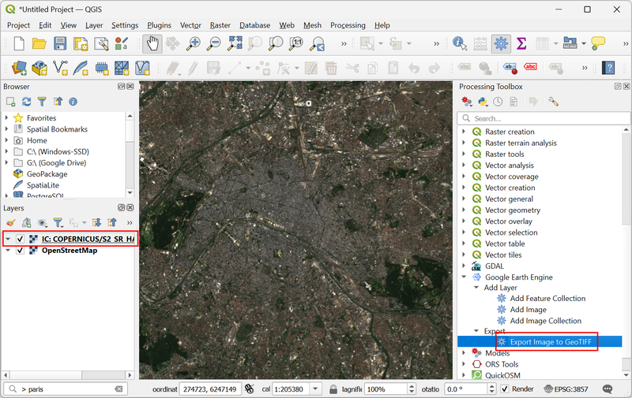

11. In the Export Image to GeoTIFF dialog, select `IC: COPERNICUS/S2_SR_HARMONIZED (Median)` as the EE Image. We want to export this at its native resolution, so enter `10` as the *Scale (meters)*. We can also specify the projection in which we want the output image. Click the *Select CRS* button.

    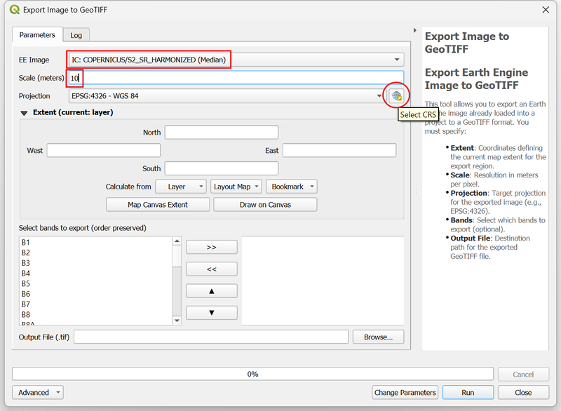

12. It is recommended to use a Projected CRS suitable for the region of interest. UTM is a good choice for such a CRS. We can find the CRS for the UTM Zone where our region is located. If you do not know the UTM Zone, you can use this handy [What UTM Zone am I in?](https://mangomap.com/robertyoung/maps/69585/what-utm-zone-am-i-in-#) map. Paris is located in the *UTM Zone 31N*. Search and select the `WGS84 / UTM zone 31N (EPSG:32631)` CRS. Once selected, click the arrow at the top of the selector to go back to the previous dialog.

    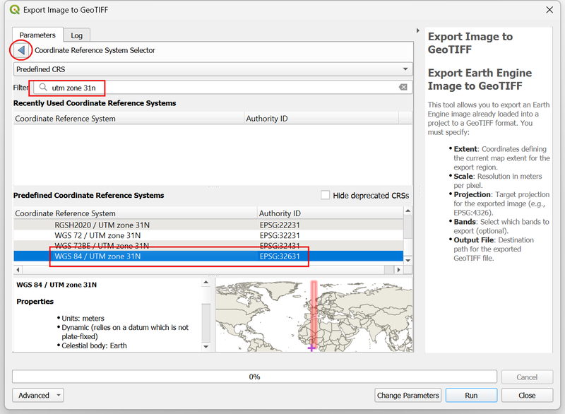

13. Next, select the Map Canvas Extent as the Extent of the image for Export. We can choose the subset and order of bands to export. For this tutorial, let’s export the B4, B3 and B2 bands. You can select each band from the left-hand section and use the >> button to add them to the list of output bands.

    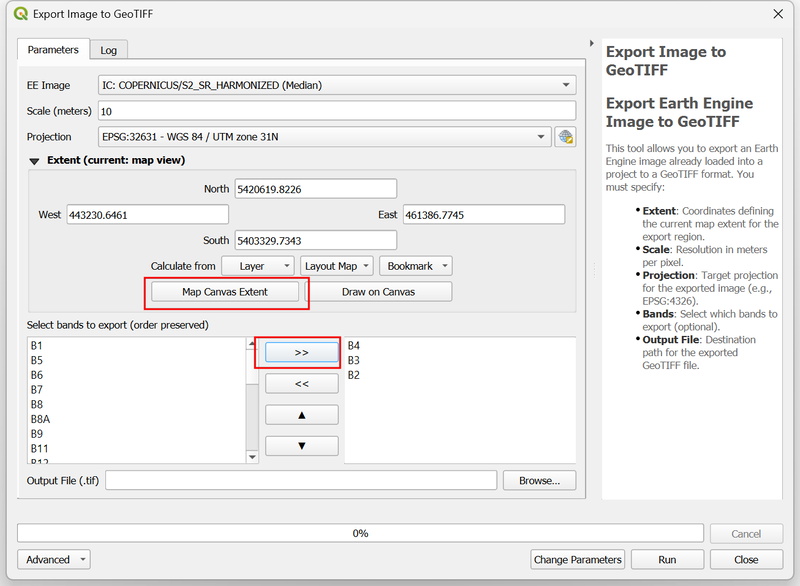

14. For the *Output File*, browse to a directory on your computer and enter the file name as `s2_median_composite.tif`. Once configured, click *Run*.

    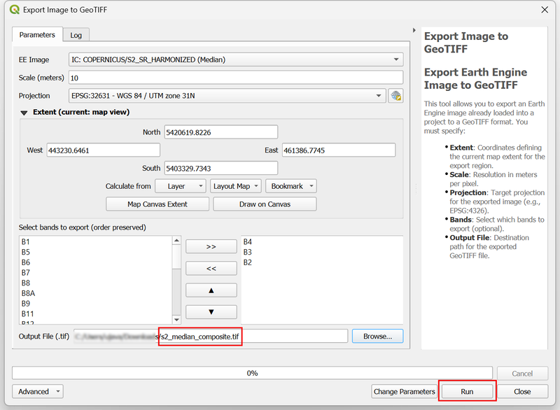

15. The requested region will be divided into smaller tiles and each tile will be downloaded separately. The algorithm will then merge the downloaded tiles into a single mosaic and save it at the requested location. Depending on the size of the region, resolution, number of bands, and your internet bandwidth, this process can take some time. Once the algorithm finishes, click *Close*.

    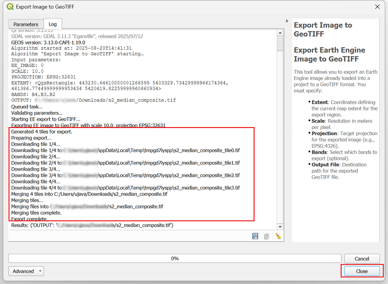

16. In the layer panel, turn off the `IC: COPERNICUS/S2_SR_HARMONIZED (Median)` layer as it is no longer required. In the *Browser* panel, locate the directory where you saved the output file. Drag and drop the `s2_median_composite.tif` file to the canvas to see the downloaded image.

    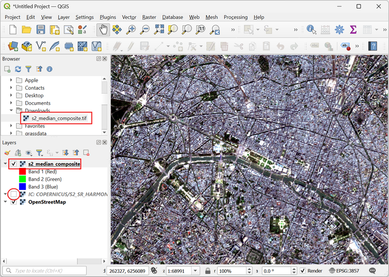

