# Visualizing Data from Earth Engine

The Google Earth Engine plugin allows you to access Earth Engine datasets programmatically within QGIS using the Python Console. You can filter and pre-process the datasets using the Earth Engine Python API and then visualize the results as a WMS layer in QGIS. This enables you to quickly iterate and create visualizations without exporting large amounts of data from Earth Engine.

In this tutorial, we will use the [NEX-GDDP-CMIP6: NASA Earth Exchange Global Daily Downscaled Climate Projections](https://developers.google.com/earth-engine/datasets/catalog/NASA_GDDP-CMIP6) dataset and use the GEE Python API to create a Map layer of mean maximum daily temperature for a chosen year under a chosen model and scenario. We will then load and visualize this layer in QGIS on a globe.

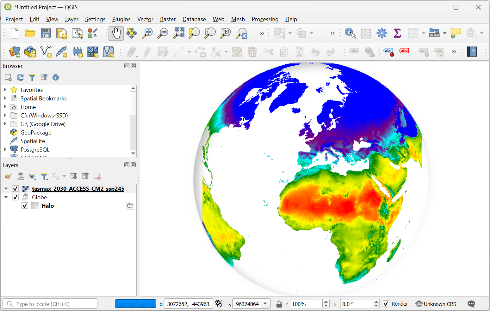


1. Open the QGIS Python Consolve from *Plugins → Python Console*.

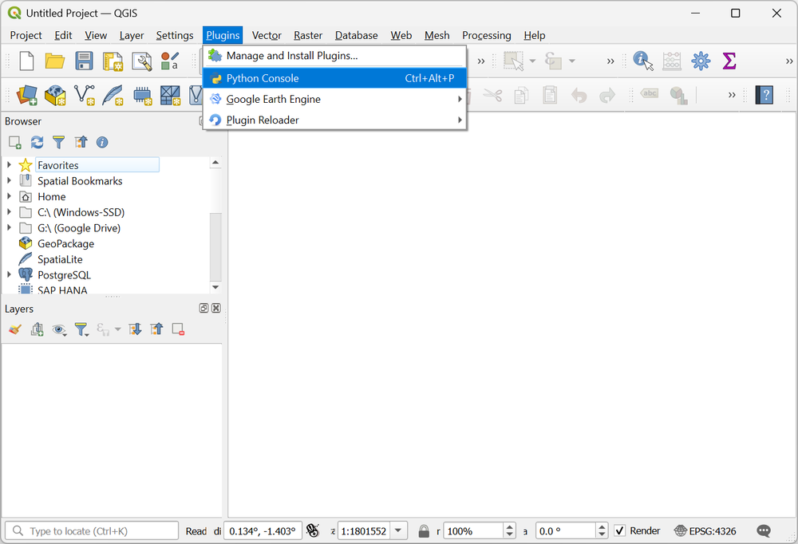

2. The Python Console allows you to write, edit and run Python scripts in QGIS. Click the *Show Editor* button to open the *Editor* panel.

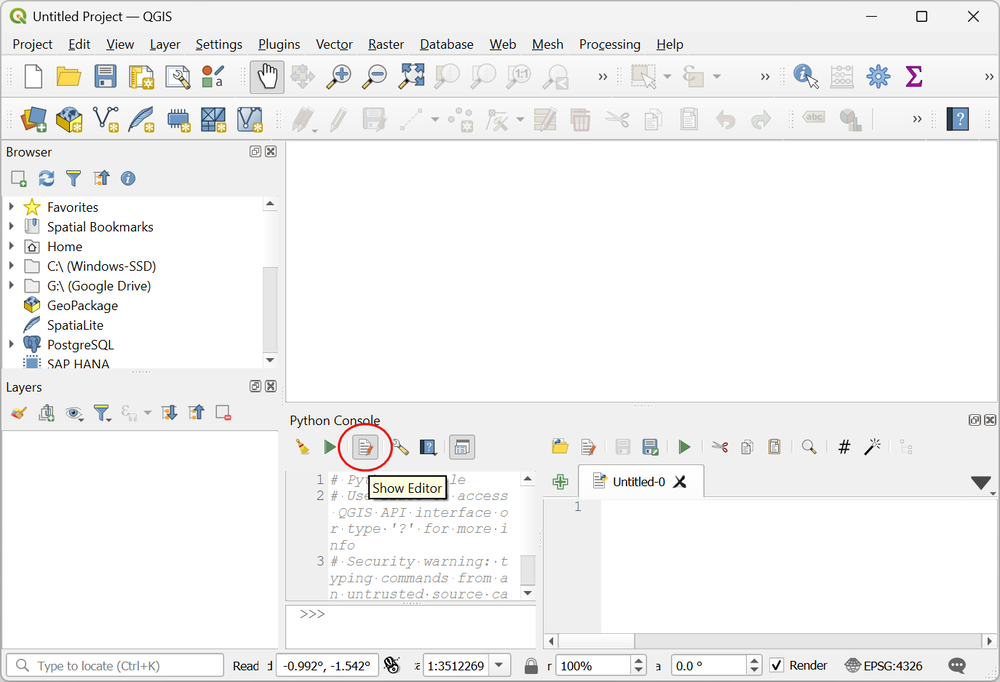

3. Once the Google Earth Engine plugin has been installed, you are able to access the EE Python API by importing the `ee` module in the Python Console. The plugin also adds functions from the `Map` module to load EE data layers in QGIS canvas. Copy/paste the following block of code in the editor and click the *Run Script* button. If the script runs without any errors - it means the plugin has been installed and configured correctly. If you get any errors, follow the [Installation Guide](../installation.md) to install and configure the Google Earth Engine plugin.

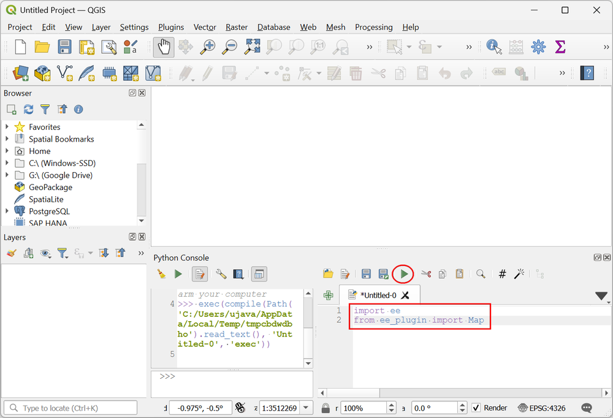

```python
import ee
from ee_plugin import Map
```
4. We can now write code to access the `NASA/GDDP-CMIP6` ImageCollection, apply a filter to select the images for the chosen band, year, model and scenario, convert the units from Kelvin to Celcius and calculate the mean annual values. All of this processing is done on the Earth Engine servers. Once we are ready to visualize the results, we use the `Map.addLayer()` function to add the results to QGIS. Copy/paste the code below into your Python Console Code Editor and click *Run Script*. A new layer `tasmax_2030_ACCESS-CM2_ssp245` will be added to the *Layers* panel. This is a WMS layer that is streaming tiles from the Earth Engine servers. 

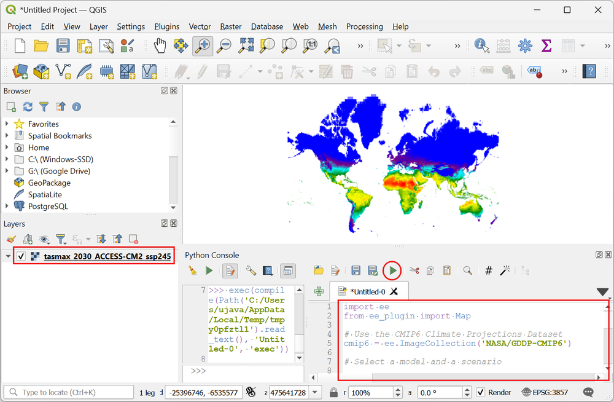

```python
import ee
from ee_plugin import Map

# Use the CMIP6 Climate Projections Dataset
cmip6 = ee.ImageCollection(`'NASA/GDDP-CMIP6'`)

# Select a model and a scenario

model = 'ACCESS-CM2'
scenario = 'ssp245'

# Select the band
# Here we are using maximum air temperature
band = 'tasmax'

# Select the year
year = 2030
startDate = ee.Date.fromYMD(year, 1, 1)
endDate = startDate.advance(1, 'year')

filtered = cmip6 \
.filter(ee.Filter.date(startDate, endDate)) \
.filter(ee.Filter.eq('model', model)) \
.filter(ee.Filter.eq('scenario', scenario)) \
.select(band)

# Temperature values are in Kelvin
# convert to Celcius

def scaleValues(image):
return image \
    .subtract(273.15) \
    .copyProperties(image,
    ['system:time_start', 'model', 'scenario'])

scaled = filtered.map(scaleValues)

# Calculate average daily maximum temperature
mean = scaled.mean()

tempVis = {
'min': 10,
'max': 40,
'palette': ['blue', 'purple', 'cyan', 'green', 'yellow', 'red'],
}

layer_name = f'{band}_{year}_{model}_{scenario}'
Map.addLayer(mean, tempVis, layer_name)
```

5. A global layer like this is best visualized on a globe. We will use another QGIS plugin named **Globe Builder** to create a custom orthographic projection for rendering this layer. You can close the *Python Console* and go to *Plugins → Manage and Install Plugins*, switch to the *All* tab and search for the *Globe Builder* plugin. Click *Install Plugin*.

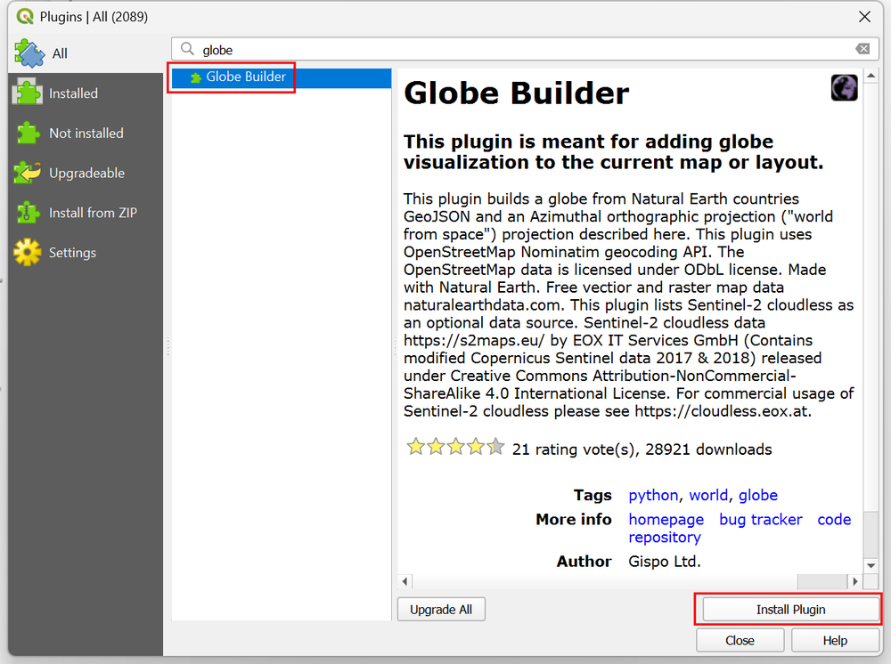

1. Once the plugin is installed, launch it from *Plugins → Globe Builder → Build Globe view*. 

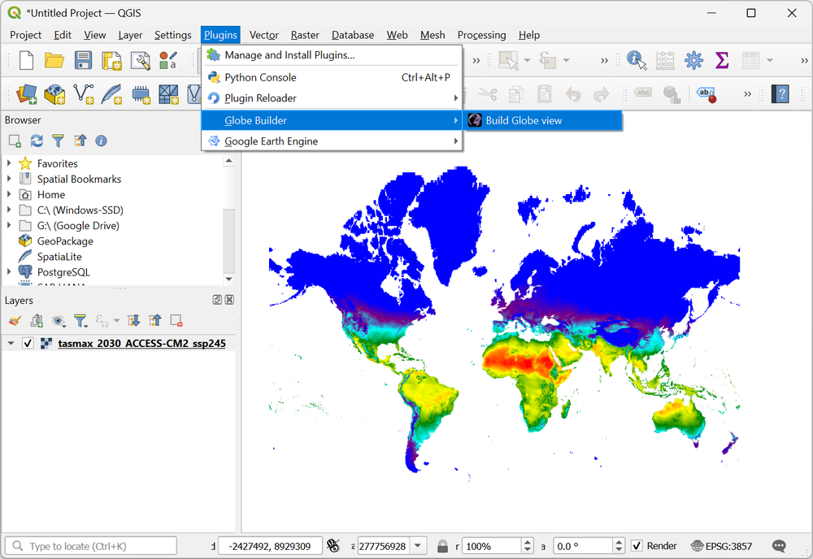

2. In the *Globe Builder* panel, you have an option to opverlay various global data layers and/or graticule layers. For this tutorial, we don't need them, so uncheck all the data sources. Select `Azimuthal Orthographic` as the *Projection*.

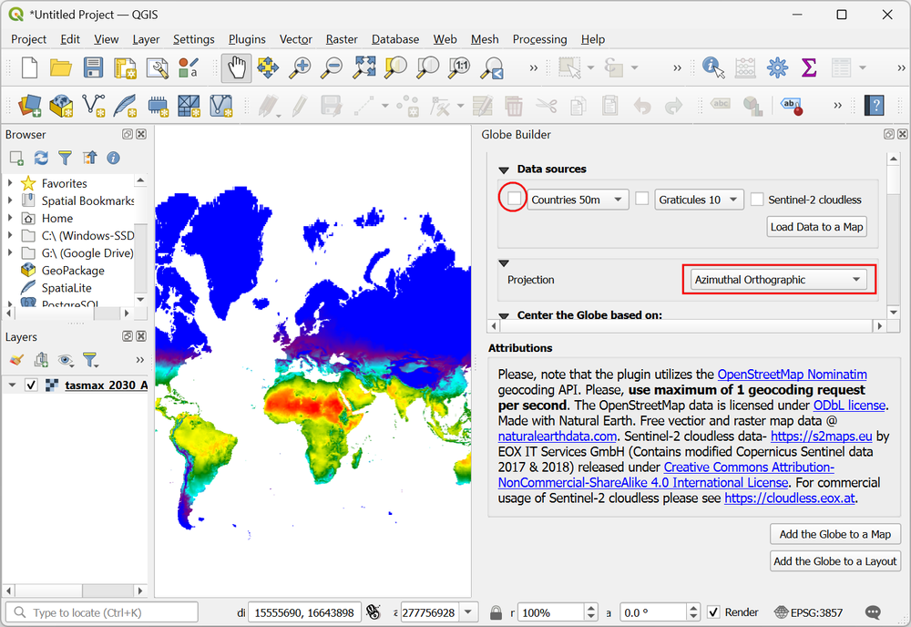

3. Scroll down and in the *Center the Globe based on:* section, choose the *Coordinates* option. Enter coordinates `0, 30`. This will create a cutom orthographic projection centered at these coordinates.

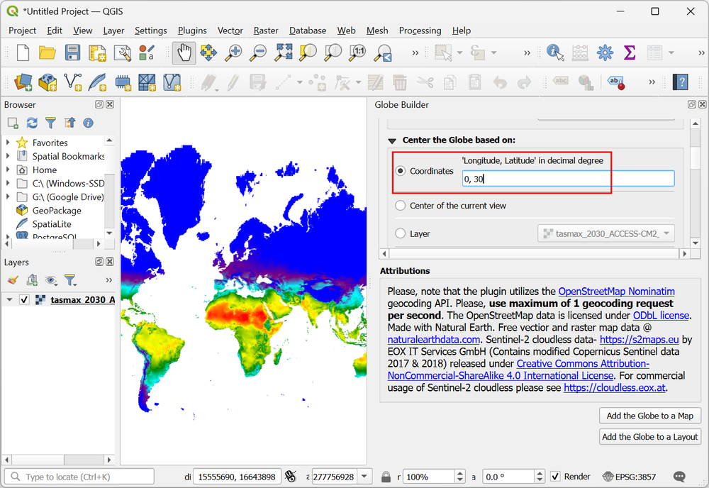

4. Lastly, under the *Visualization* section, choose `White` as the *Background* color. Once done, click the *Add the Globe to a Map* button.

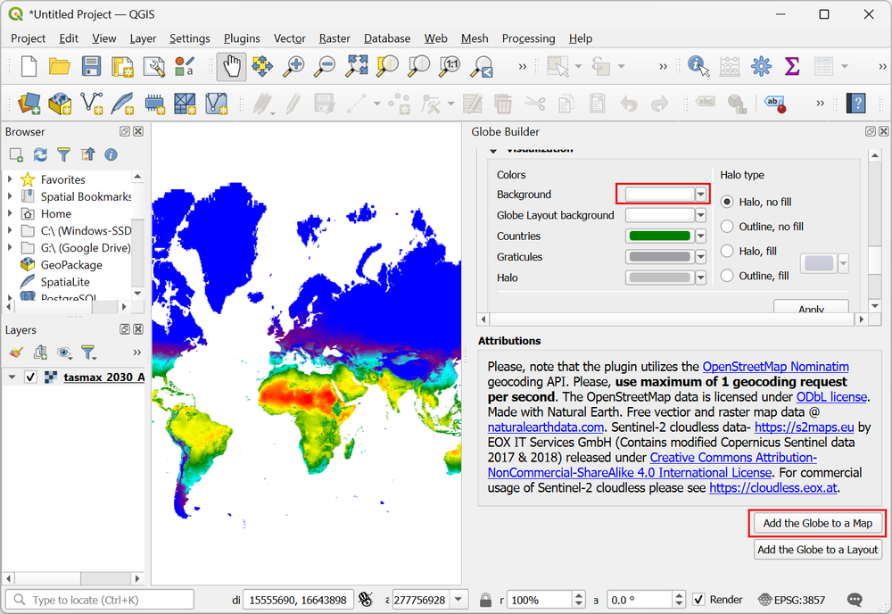

5.  The plugin will set the *Project CRS* to a custom projection based on your configuration. The Earth Engine layer will request new tiles from the server in this projection and they will be rendered as a globe.

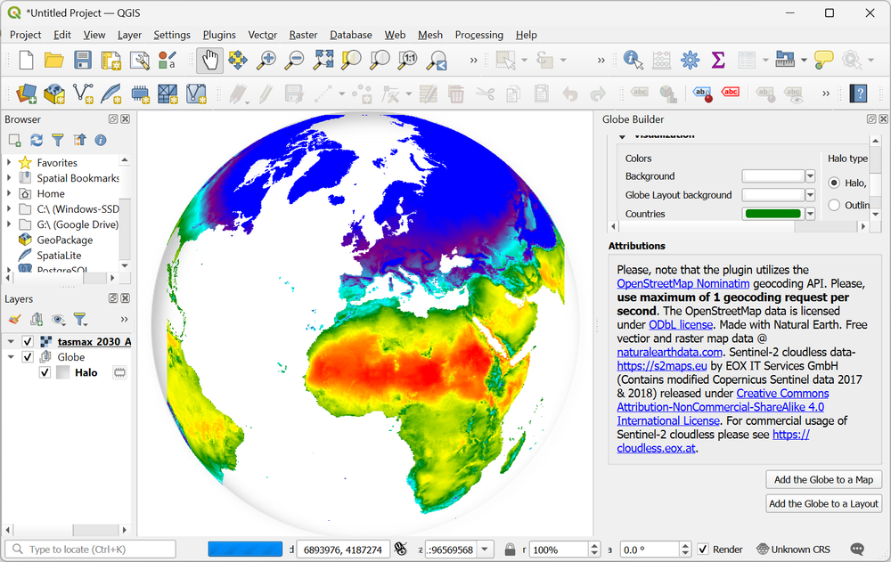
